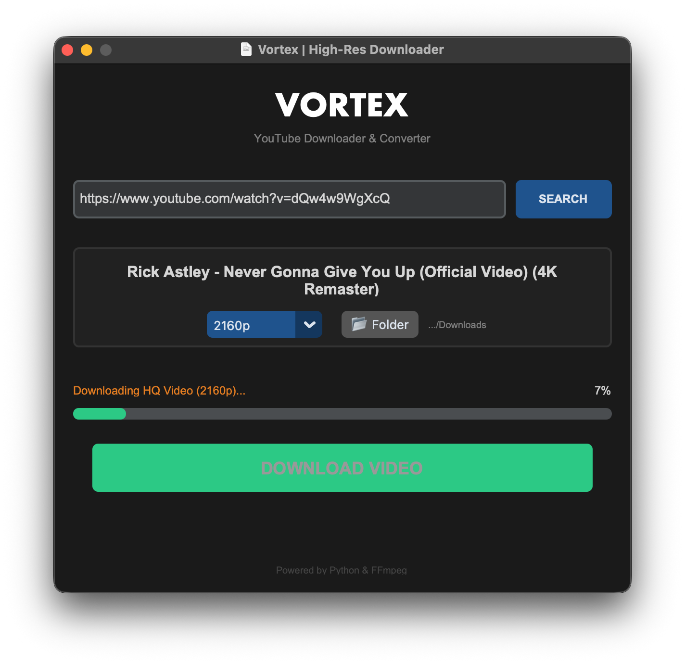

# Vortex
**The Modern High-Resolution YouTube Downloader**


Vortex is a sleek, dark-themed GUI application that bypasses YouTube's resolution limits. Unlike standard downloaders, Vortex uses **FFmpeg** to merge separate video and audio streams, allowing you to download **1080p, 1440p, and 4K** videos with audio.



## Features
- **High Resolution Support:** Downloads 1080p and 4K video, bypassing the 360p limit.

## Installation

1. **Clone the repository**
   ```bash
   git clone https://github.com/SmoothCdoer9981/Vortex.git
   cd Vortex
2. **Install the requirements**
 ```pip install -r requirements.txt```
3. **Run ```main.py```**
   ```python main.py```
